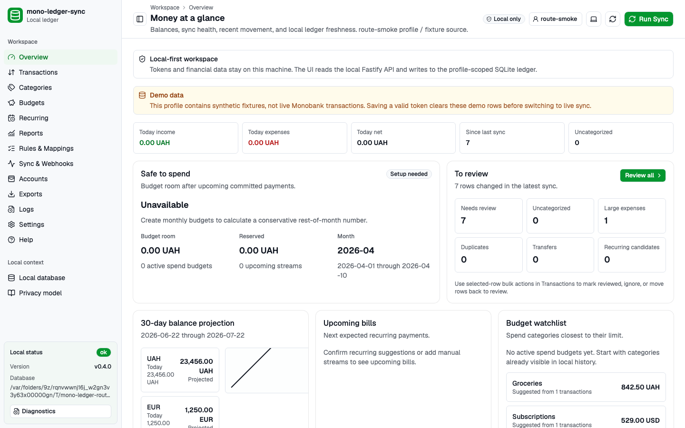
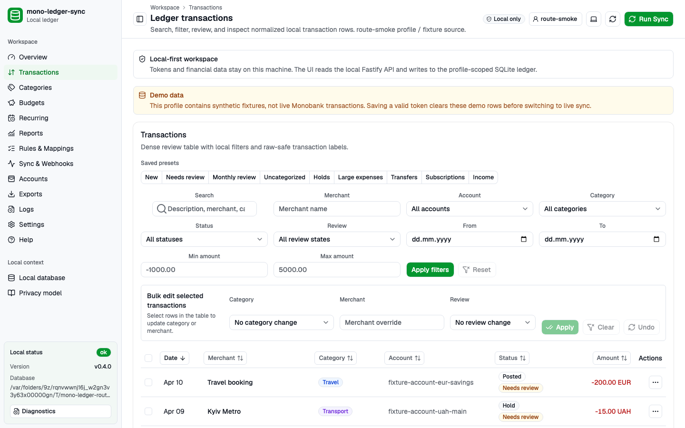
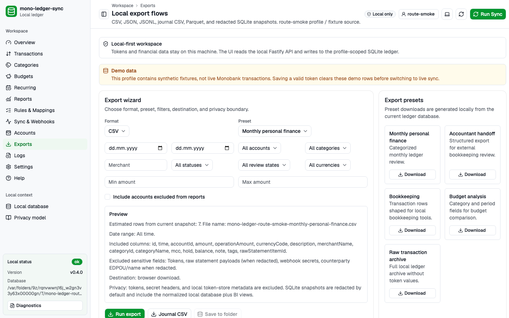

# mono-ledger-sync

[](https://www.npmjs.com/package/mono-ledger-sync)
[](https://github.com/afurm/mono-ledger-sync/actions/workflows/ci.yml)
[](LICENSE)

Local-first TypeScript app for syncing Monobank transactions into a private personal finance ledger.

`mono-ledger-sync` is an early TypeScript app/package for building a local-first Monobank ledger workflow. The product direction is a local web app backed by a local API server and SQLite. The project is designed for people who want to own their financial data locally: tokens and transaction data stay on the user's machine, production sync talks to Monobank directly, and raw Monobank payloads are preserved separately from normalized ledger entries.

## Status

This package ships a local-first Monobank personal finance workspace: a Fastify local app, SQLite-backed storage, a typed Monobank HTTP adapter, ledger queries, webhook hint recording, deterministic exports, and a compact browser UI. The product talks to the real Monobank personal API at `https://api.monobank.ua` for a real user session. A clearly labeled first-run demo uses synthetic fixtures and is erased before a valid live token is activated.

## Live by default

For a real user, every account, jar, statement, currency rate, and webhook comes from that user's own Monobank account via the personal API. The Ukrainian first-run flow leads with **Увійдіть через Monobank**: open `https://api.monobank.ua/` to create a personal API token, paste it into the local app, and the local Fastify server validates the token with a live `GET /personal/client-info` before saving it. The product never sends the token to any server controlled by this project.

The Monobank personal API is for the user's own data on their own machine. Do not use this project as a hosted, team, or business service for other people's banking data.

`MONOBANK_TOKEN` is a CI-only escape hatch. It exists so the opt-in live smoke test (`npm run test:live-monobank`, gated by `MONO_LEDGER_SYNC_LIVE_MONOBANK_TESTS=1`) can call the real bank without going through the in-app paste-token flow. It is not part of the user-facing product flow and should not be set in a normal local dev shell.

## Release notes

- [v1.0.0](docs/release/1.0.0.md): completes the public-ready local app with an isolated first-run demo, native OS credential storage, per-account partial-sync diagnostics, completed budget and recurring workflows, transaction performance guardrails, accessibility checks, recovery/support contracts, and fixture-safe UI screenshots. The personal-token, loopback-only, local SQLite product boundary remains unchanged.
- [v0.4.0](docs/release/0.4.0.md): adds Parquet ledger exports, redacted SQLite snapshots, DuckDB-friendly BI views, local BI/accountant handoff docs, raw payload retention controls, and a mock-only Monobank provider/FOP spike behind an experimental Settings flag. Provider mode does not graduate; the personal-token local app remains the default path. Test count 239 pass / 0 fail / 4 skipped.
- [v0.3.0](docs/release/0.3.0.md): modularization of the local API server (`src/server/index.ts` 4419 → 1765 lines, 11 route modules under `src/server/routes/`) and the Vite web app (`src/web/App.tsx` 11154 → 1111 lines, 10 per-route components under `src/web/routes/`, new `src/web/api-types.ts`). Adds manual recurring items, on-the-fly category-rule creation, ledger review states (migration `0022`), local cockpit workflow settings (migration `0023`), the `local_exports` audit log (migration `0024`), richer ledger export filters, an `includedInReports` account toggle, and transfer-aware cashflow and savings-rate reports. Release workflow now runs `npm run smoke:web` (Playwright) as a gate. Test count 232 pass / 0 fail / 4 skipped.
- [v0.2.0](docs/release/0.2.0.md): live-by-default sign-in flow, bulk edit, category version history, diagnostics endpoint, reporting suite, recurring-payments engine, and a long-running privacy/security hardening pass. 228 commits since `v0.1.1`; test count 226 pass / 0 fail / 4 skipped.
- v0.1.1: GitHub Release `v0.1.1`; `mono-ledger-sync@0.1.1` on npm. Public discoverability metadata follow-up.
- v0.1.0: Initial public package release. `mono-ledger-sync@0.1.0`; initial commit `5b1b6c2`.

## Goals

- Sync personal Monobank transactions into a durable local ledger.
- Keep banking tokens and personal finance data off hosted project servers.
- Support explicit fixture-backed development for tests and offline contributor workflows.
- Provide a small TypeScript API, local server boundary, and browser UI that can grow into SQLite storage, exports, reports, and a Vite web app.

## Quick start

```sh
npx mono-ledger-sync
```

Open `http://127.0.0.1:3000`, then choose one path:

1. Select **Переглянути демо-дані** to inspect a synthetic local ledger without
   a token. Every route displays a demo-data warning.
2. For live data, create a personal token at `https://api.monobank.ua/`, open
   **Налаштування**, paste the token, confirm local-only handling, and save it.
3. Run sync from **Синхронізувати**, review transactions, configure
   budgets/recurring payments, then use the Export wizard or create a local
   backup.

Saving a valid live token while demo mode is active clears every demo ledger
row before switching sources. Demo and live transactions are never mixed.

The app stores its SQLite database in the local application data directory. Use
`MONO_LEDGER_SYNC_DATA_DIR` to select another location before first startup.
Recovery and profile moves are documented in
[Migration and recovery](docs/migration-and-recovery.md).

## Screenshots







## Local development

```sh
npm install
npm run dev
```

`npm run dev` builds the package and starts the local Fastify server at
`http://127.0.0.1:3000`. The browser UI starts in Monobank API mode. The
first-run demo is available without changing development environment variables.

Export presets are available through the local API and browser UI for
`accountant-handoff`, `monthly-personal-finance`, `bookkeeping`,
`budget-analysis`, and `raw-transaction-archive`. CSV, JSON, JSONL, journal
CSV, Parquet, and redacted SQLite snapshot exports are deterministic for the
same database state and filters so users can diff or version their own local
data. See [DuckDB workflow](docs/integrations/duckdb.md),
[local BI](docs/integrations/local-bi.md), and
[accountant handoff](docs/accountant-handoff.md).

The in-app sign-in flow is the supported way to start syncing a real Monobank account: open `http://127.0.0.1:3000`, paste a personal API token from `https://api.monobank.ua/`, and the local server validates it before saving. `MONOBANK_TOKEN` is for the opt-in live smoke test only — see **Live by default** above.

## Library API

```ts
import { createSyncPlan } from "mono-ledger-sync";

const plan = createSyncPlan({
  profile: "default",
  source: "monobank",
});
```

## Privacy model

- No hosted token relay.
- No default cloud storage.
- No hosted account is required for local browsing, local backups, or local exports.
- Personal API tokens use macOS Keychain Services, Windows Credential
  Manager/Credential Locker, or Linux Secret Service, with an explicit
  session-only fallback when the provider is unavailable.
- Use personal Monobank API tokens only for your own data on your own machine; do not use this project as a hosted or shared service for other people's banking data.
- Webhook events should be treated as hints and reconciled through statement pulls.
- Logs and errors must redact tokens and sensitive financial identifiers.
- Secure token persistence should follow
  [`docs/decisions/0008-secure-token-storage.md`](docs/decisions/0008-secure-token-storage.md):
  use OS credential stores for packaged builds, keep SQLite out of token
  storage, and fall back to session-only handling when no secure provider is
  available.
- Raw statement payload retention defaults to 90 days and can be set to `0` to
  keep raw payloads indefinitely. See
  [privacy and retention review](docs/privacy-retention-review.md).

## Webhook endpoint safety

The local server exposes webhook settings in `/api/app/config.webhook`:

- `webhook.host`: usually `127.0.0.1`
- `webhook.port`: local API port
- `webhook.path`: one high-entropy per-instance path (for example `/api/webhooks/monobank-ab12...`)
- `webhook.url`: full URL to register in Monobank personal webhook settings

The default `webhook.url` is a loopback URL for the local app. It is useful for
local health checks, but Monobank cannot deliver webhooks to `127.0.0.1` from
outside your machine.

If you need live personal webhook delivery while developing locally:

1. Start the local app with the intended port, then read the current
   `webhook.path` from the UI or `/api/app/config`.
2. Expose only that local port through a temporary HTTPS tunnel controlled by
   you.
3. Register the tunnel origin plus the exact high-entropy `webhook.path` in
   Monobank personal webhook settings.
4. Keep the tunnel open only while you are actively using it, then remove the
   webhook URL from Monobank or stop the tunnel.

Do not bind the local API to a public interface unless passcode protection is
enabled, reuse stale tunnel URLs, share the tunnel URL publicly, or put tokens
in webhook URLs. The route path is an unguessable local receiver path, not an
authentication system.

Webhook payloads are recorded as local hints and are reconciled through
statement pulls before they affect the final ledger state.

## Disclaimer

This project is a local data ownership tool, not financial, tax, accounting, or legal advice. Verify exported data before making financial decisions or sending records to an accountant.

## Development

```sh
npm install
npm run dev
npm run typecheck
npm test
npm run test:live-monobank
npm run coverage
npm run format
```

`npm run dev` starts the local Fastify app server on `http://127.0.0.1:3000`.
The app exposes the browser UI at `/`, health and configuration endpoints,
ledger summary/account/transaction endpoints, sync run endpoints, webhook
hint ingestion, and CSV/JSON/JSONL exports. The default product path is
live — the local server talks to `https://api.monobank.ua` once a personal
API token is saved in the in-app sign-in flow. Sanitized fixtures remain
available only through explicit development mode; pass
`MONO_LEDGER_SYNC_SOURCE=fixture npm run dev` to skip live calls.
Use `MONO_LEDGER_SYNC_PORT=3001 npm run dev` if port 3000 is already in use.
The local API binds to `127.0.0.1` by default. Binding to a non-loopback host
requires `MONO_LEDGER_SYNC_ACCESS_PASSCODE`; the server protects the browser UI
and API with Basic auth while keeping the high-entropy Monobank webhook receiver
available for delivery.
Use `npm run web:dev` when working on the Vite UI; it starts the same local API
server and proxies browser requests through `http://127.0.0.1:5173`.

`npm run test:live-monobank` is an opt-in smoke test for the real Monobank
adapter. It skips unless `MONO_LEDGER_SYNC_LIVE_MONOBANK_TESTS=1` and
`MONOBANK_TOKEN` are set, so default local and pull-request validation never
calls the live API. This is the only supported use of `MONOBANK_TOKEN`.

The local API token endpoint stores saved Monobank tokens through the default
token store. Linux uses Secret Service, macOS uses Keychain Services, and
Windows uses Credential Manager/Credential Locker. Secrets travel through
stdin, not command arguments. Unsupported or unavailable secure stores fall
back to the running session instead of writing plaintext credentials to SQLite
or config files.

### Rotating a Monobank token

Rotate the personal API token from the local settings screen or the local API;
do not edit SQLite, generated exports, or config files to change credentials.

1. Create a replacement personal token in Monobank.
2. Open **Settings -> Monobank token**, paste the replacement token, confirm the
   local-only handling checkbox, and save it for the active local profile. The
   same flow is available through `POST /api/app/token` with the active
   `profile` and replacement `token`.
3. Confirm the token status in settings. Persistent secure storage means the
   token survived through the OS credential store; session-only storage means it
   is available only until the local server process stops.
4. Run a Monobank sync after saving the replacement token.
5. Revoke the old token in Monobank after the replacement token works.

If a token may have been exposed, remove it from **Settings -> Monobank token**
with the explicit deletion checkbox, revoke it in Monobank, and restart the
local server if the UI reported session-only token handling.

Release automation is documented in [docs/release.md](docs/release.md).
Domain contracts are documented in [docs/domain-model.md](docs/domain-model.md).
The privacy and security threat model is documented in
[docs/threat-model.md](docs/threat-model.md).
The v1 distribution, accessibility, localization, release, recovery, and
support contracts are documented in
[distribution](docs/decisions/0012-v1-distribution.md),
[accessibility](docs/accessibility.md),
[localization](docs/decisions/0013-localization.md),
[release checklist](docs/v1-release-checklist.md),
[migration and recovery](docs/migration-and-recovery.md), and
[support boundary](docs/support-boundary.md).
Common local workflows are documented in
[examples/sample-workflows](examples/sample-workflows).
Start with the
[minimum local product flow](examples/sample-workflows/minimum-product-flow.md)
for the install, token, sync, review, categorization, and export path.

## License

MIT
